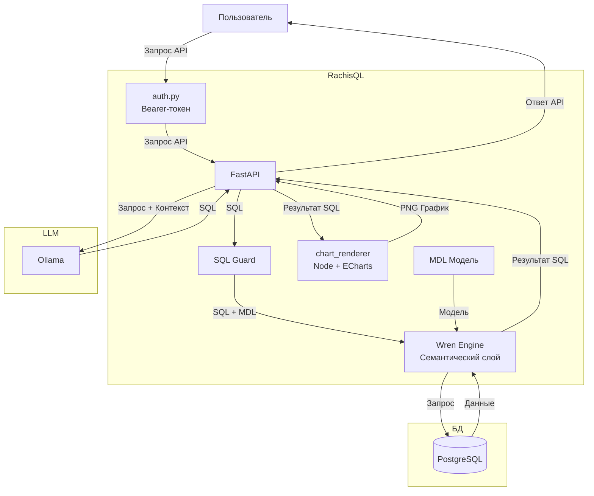

# RachisQL: Text2SQL API-бэкенд для локальных LLM (v0.4.5)

Своя реализация text-to-SQL: локальная LLM (Ollama) генерирует SQL,
guard разрешает только read-only запросы, PostgreSQL выполняет,
семантический слой Wren (MDL) даёт точный контекст схемы и
масштабируется на сотни таблиц без раздувания промпта для LLM. Работает как
самостоятельный API, а значит можно подключить к любому фронту.


## Функционал

**Text-to-SQL с самокоррекцией**
* Вопрос на естественном языке → рабочий SQL-запрос → PNG-график, автоматически.
* Если Wren или SQL-guard отклоняют первую попытку — модель получает
  свою же ошибку обратно и переписывает запрос (`SQL_MAX_ATTEMPTS`),
  без участия пользователя.
* Локальная LLM (Ollama), модель заменяется одной строкой в переменной окружения.

**Безопасность SQL "на входе"**
* `sql_guard.py` разбирает запрос через `sqlparse` на уровне токенов
  (не regex по тексту) — ловит `DROP`/`DELETE`/`UPDATE` даже внутри
  вложенных CTE, но не путает служебные слова со словами в текстовых
  литералах.
* Принудительный `LIMIT`, если модель его не поставила сама.

**Семантический слой Wren — масштабируется на сотни таблиц**
* Схема не дампится в промпт целиком, под каждый вопрос Wren ищет
  релевантные таблицы через embedding-поиск, а полное описание
  найденных моделей достраивается напрямую из `metadata.yml`.
* `wren dry-run` проверяет сгенерированный SQL против реальной модели
  данных и живой БД до того, как он попадёт в Postgres.
* Опциональные sample rows — несколько реальных строк из найденных
  таблиц в контексте, когда одних описаний колонок недостаточно
  (точные имена, формат значений). Отключается на уровне конкретной
  таблицы (`no_sample_rows: true`) для чувствительных данных.

**Разрешение эталонных значений**
* Пользователь пишет "Москве", "г. Москве" или с опечаткой — SQL
  генерируется с любым из этих вариантов, а `value_resolver.py`
  подменяет значение на эталонное из справочника (`knowledge/dictionaries/*.yml`)
  через нечёткое сравнение, не полагаясь на то, что модель угадает
  точное написание с первого раза. На выходе получаем корректное "Москва" для поиска через Where.

**Аутентификация и защита**
* Bearer-токены на `/ask` и `/ask/image`, хранятся как SHA-256-хэши,
  сравнение constant-time.
* Rate limit на токен, отдельно для каждого потребителя API.

**Графики ECharts в PNG"**
* Тип графика (bar/line) и группировка по датам — автоматически.
* Русские сокращения месяцев в два ряда ("Янв / 2026"), гранулярность
  (день/месяц/год) определяется по факту данных.
* Хронологическая сортировка по-умолчанию — не полагаемся на `ORDER BY` в
  сгенерированном SQL.
* Пустые/нулевые значения не засоряют график лишними подписями,
  пересекающиеся подписи к столбцам скрываются автоматически (ECharts `labelLayout`).

**Инфраструктура**
* Docker Compose, health checks на каждый сервис, пул соединений
  Postgres, ротация логов, fail-fast валидация конфига при старте.
* Метрики использования контекстного окна и скорости генерации в
  логах на каждый запрос.


## Архитектура



Если Wren не настроен или недоступен — код прозрачно откатывается на
прямую интроспекцию `information_schema` и выполнение через `asyncpg`,
без падения приложения.


## Деплой на сервер по SSH

1. Клонируем репозиторий:
   ```bash
   git clone git@github.com:kirgonnacode/RachisQL.git
   ```

2. Ставим Docker и Docker Compose, если их ещё нет:
   ```bash
   curl -fsSL https://get.docker.com | sh
   sudo apt install docker-compose-plugin
   ```

3. Если есть GPU — ставим NVIDIA Container Toolkit
   (иначе просто удали `deploy.resources` секцию у `ollama` в docker-compose.yml,
   будет работать на CPU, но медленнее генерация).

4. Настраиваем окружение:
   ```bash
   cp .env.example .env
   nano .env
   ```

5. Проверяем что в .env прописали именно read-only пользователя Postgres (это вторая линия защиты
   помимо `sql_guard.py`)

6. Генерируем хотя бы один токен ДО первого запуска (важно —
   `docker-compose.yml` монтирует `backend/tokens.txt` как файл; если
   его не будет на диске на момент первого `docker compose up`, Docker
   создаст на этом месте пустую *директорию* вместо файла, и приложение
   упадёт с ошибкой). Скрипт не требует Docker,
   использует только стандартную библиотеку Python:
   ```bash
   python3 backend/scripts/generate_token.py <имя токена>
   # скопируй строку "label:hash" из вывода в backend/tokens.txt:
   echo "<имя токена>:<hash_из_вывода>" > backend/tokens.txt
   # сырой токен (не hash!) сохрани отдельно - его нужно будет отдать подключаемому фронту
   ```

7. Поднимаем стек:
   ```bash
   docker compose up -d --build
   ```

8. Загружаем модель в Ollama (любая модель, поддерживаемая Ollama —
   в `.env` уже стоит `gemma4:e4b`, также проверено семейство `qwen` и другие модели `gemma4`):
   ```bash
      docker compose exec ollama ollama pull gemma4:e4b
   ```

9. Проверяем (порт — тот, что слева от двоеточия в `ports:` вашего `docker-compose.yml`, по умолчанию `8001`):
   ```bash
      curl http://localhost:8001/health   # без токена - health открыт намеренно
      curl -X POST http://localhost:8001/ask \
         -H "Content-Type: application/json" \
         -H "Authorization: Bearer <сырой_токен_из_шага_6>" \
         -d '{"question": "сколько сотрудников в каждом отделе?"}'
   ```

Нужен ещё один токен для другого потребителя позже? Тот же скрипт,
новая строка в `backend/tokens.txt`, `docker compose restart backend`


## Терминальный тест перед подключением

```bash
pip install requests
python cli_test.py "сколько заказов за последний месяц по дням" --token <твой_токен>
```


## Настройка Wren — семантический слой

Без него приложение уже работает (fallback на прямую интроспекцию
Postgres), но с ним — заметно точнее и масштабируется на большое
число таблиц без раздувания промпта.

1. Опиши таблицу в `backend/wren/models/<имя_таблицы>/metadata.yml`
   (одна папка — одна таблица; поля колонок — `name`, `type`,
   `properties.description`, опционально `properties.dictionary` для
   связки с эталонным справочником и `properties.no_sample_rows` для
   исключения из sample rows).

2. Собери MDL:
```bash
   docker compose exec backend bash -c "cd /app/wren && wren context validate && wren context build"
```

3. Переиндексируй:
```bash
   docker compose exec backend bash -c "cd /app/wren && wren memory index"
```

4. Проверь:
```bash
   docker compose exec backend bash -c "cd /app/wren && wren memory fetch -q 'тестовый вопрос' --threshold 1 --output json"
```

Креды подключения передаются в Wren инлайн через `WREN_CONNECTION_INFO`
в `docker-compose.yml` (см. "Overriding defaults" в docs.getwren.ai) —
не хранятся в файле профиля внутри образа.

Шаги 1-3 повторяй после любого изменения `models/`/`knowledge/` —
и `context build`, и `memory index` идут в паре, одно без другого
не работает корректно.


## Логи

Пишутся в `./logs/app.log` на хосте (смонтировано в контейнер, с
ротацией) — там же видно, какой SQL сгенерировала модель на каждый
вопрос, сколько заняла генерация, и какой процент контекстного окна
занял промпт (`LOG_LEVEL` в `.env` управляет подробностью).


## Конфигурация

Полный список — в `.env.example`:

| Переменная | По умолчанию | Что делает |
|---|---|---|
| `OLLAMA_MODEL` | `gemma4:e4b` | Любая модель, скачанная в Ollama |
| `OLLAMA_NUM_CTX` | `8192` | Контекстное окно — увеличивай, если в логах видишь `>80%` занятости |
| `SQL_MAX_ATTEMPTS` | `2` | Попытки самокоррекции SQL — больше попыток = точнее, но дольше ответ |
| `WREN_SEARCH_LIMIT` | `15` | Сколько кандидатов ищет Wren под один вопрос перед сборкой контекста |
| `WREN_SEARCH_MAX_DISTANCE` | выкл. | Порог релевантности embedding-поиска |
| `SAMPLE_ROWS_ENABLED` / `_COUNT` | `false` / `1` | Реальные строки из БД в промпте |
| `DICTIONARY_MATCH_THRESHOLD` | `75` | Порог нечёткого совпадения для эталонных значений (0-100) |
| `RATE_LIMIT_PER_MINUTE` | `20` | На токен, не на пользователя — если у фронта один общий токен на всех, лимит общий |


## Технологический стек

**Backend**: Python, FastAPI, asyncpg, sqlparse, rapidfuzz
**LLM**: Ollama
**Семантический слой**: Wren CLI (MDL, embedding-поиск, LanceDB)
**Графики**: Node.js, Apache ECharts, node-canvas
**Данные**: PostgreSQL
**Инфраструктура**: Docker, Docker Compose


## Лицензия

GNU AGPL v3 — см. `LICENSE`.


**Разработчик:** Малышев Кирилл Игоревич (@kirgonnacode)  