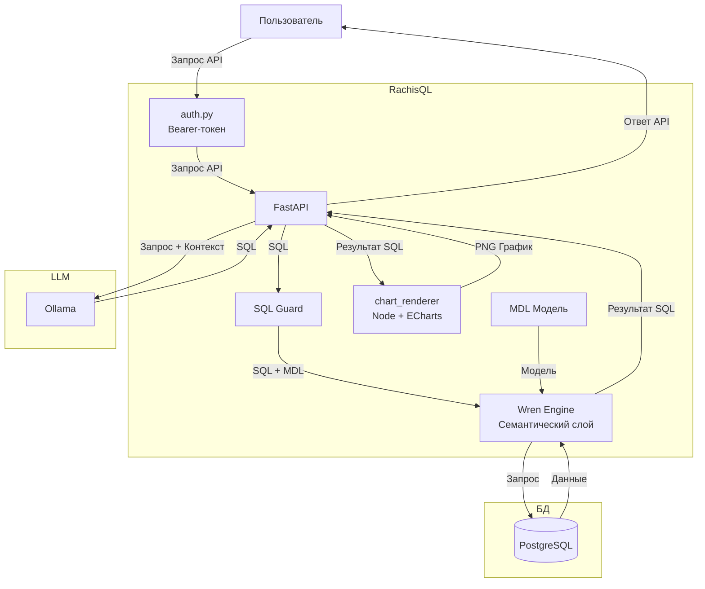

# RachisQL: Text2SQL API-бэкенд для локальных LLM (v0.3.4)

Своя реализация text-to-SQL: локальная LLM (Ollama/Qwen) генерирует SQL,
guard разрешает только read-only запросы, PostgreSQL выполняет,
опционально семантический слой Wren (MDL) даёт более точный контекст схемы.


## Функционал

* **PNG график**: Пользователь в ответ на свой вопрос на естественном языке получает график на основе данных из БД, тип графика определяется автоматически.

## Архитектура




## Деплой на сервер по SSH

1. Клонируем репозиторий:
   ```bash
   git clone git@github.com:kirgonnacode/RachisQL.git
   ```

2. Ставим Docker и Docker Compose, если их ещё нет:
   ```bash
   curl -fsSL https://get.docker.com | sh
   sudo apt install docker-compose-plugin
   ```

3. Если есть GPU — ставим NVIDIA Container Toolkit
   (иначе просто удали `deploy.resources` секцию у `ollama` в docker-compose.yml,
   будет работать на CPU, но медленнее генерация).

4. Настраиваем окружение:
   ```bash
   cp .env.example .env
   nano .env
   ```

5. **Проверяем что в .env прописали именно read-only пользователя Postgres** (это вторая линия защиты
   помимо `sql_guard.py`):

6. **Генерируем хотя бы один токен ДО первого запуска** (важно —
   `docker-compose.yml` монтирует `backend/tokens.txt` как файл; если
   его не будет на диске на момент первого `docker compose up`, Docker
   создаст на этом месте пустую *директорию* вместо файла, и приложение
   упадёт с ошибкой). Скрипт не требует Docker,
   использует только стандартную библиотеку Python:
   ```bash
   python3 backend/scripts/generate_token.py <имя токена>
   # скопируй строку "label:hash" из вывода в backend/tokens.txt:
   echo "<имя токена>:<hash_из_вывода>" > backend/tokens.txt
   # сырой токен (не hash!) сохрани отдельно - его нужно будет отдать подключаемому фронту
   ```

7. Поднимаем стек:
   ```bash
   docker compose up -d --build
   ```

8. Загружаем модель в Ollama:
   ```bash
   docker compose exec ollama ollama pull qwen2.5-coder:7b
   ```

9. Проверяем:
    ```bash
    curl http://localhost:8000/health   # без токена - health открыт намеренно
    curl -X POST http://localhost:8000/ask \
      -H "Content-Type: application/json" \
      -H "Authorization: Bearer <сырой_токен_из_шага_6>" \
      -d '{"question": "сколько сотрудников в каждом отделе?"}'
    ```

Нужен ещё один токен для другого потребителя позже? Тот же скрипт,
новая строка в `backend/tokens.txt`, `docker compose restart backend`
(файл читается один раз при старте, hot reload токенов не сделан на данный момент).


## Терминальный тест перед подключением

```bash
pip install requests
python cli_test.py "сколько заказов за последний месяц по дням" --token <твой_токен>
# или: export TEXT2SQL_API_TOKEN=... и не передавать --token каждый раз
# сохранит chart.png рядом со скриптом и распечатает SQL + сырые строки
```


## Логи

Пишутся в `./logs/app.log` на хосте (смонтировано в контейнер) — там же
видно, какой SQL сгенерировала модель на каждый вопрос.


## Безопасность

1. **Bearer-токены** (`backend/app/auth.py`) — на `/ask` и `/ask/image`.
   Токены хранятся не в открытом виде, а как SHA-256-хэши в
   `backend/tokens.txt`. Если файл утечёт, сами токены из хэшей не восстановить напрямую.
   hmac.compare_digest - сравнение за постоянное время, чтобы нельзя было подобрать токен по разнице в скорости ответа (timing attack)

2. **Rate limit** (`backend/app/rate_limit.py`) — по умолчанию 20
   запросов в минуту на токен (`RATE_LIMIT_PER_MINUTE` в `.env`). Простой
   in-memory лимитер, без Redis - этого достаточно для нескольких
   доверенных потребителей.

3. **Файрвол** — порт `8000` слушает на всех интерфейсах (Apache с
   другого сервера должен достучаться), поэтому обязательно ограничь
   доступ к нему только IP-адресом своего сервера:
   ```bash
   sudo ufw allow from <IP_СЕРВЕРА_С_САЙТОМ> to any port 8000 proto tcp
   sudo ufw deny 8000
   sudo ufw enable
   ```


## Как подключить полноценный Wren

Схема теперь имеет два уровня:

1. **Без Wren** (по умолчанию, если `wren context build` не запускали) -
   `schema_context.py` интроспектирует `information_schema` напрямую,
   `main.py` выполняет SQL через обычный asyncpg.
2. **С Wren** - опиши свои таблицы в `backend/wren/models/*.yml` и связи
   в `backend/wren/relationships.yml` (см. заготовку `example.yml` -
   замени на свои реальные таблицы), затем:
   ```bash
   docker compose exec backend bash
   cd /app/wren
   wren profile add --interactive     # один раз, интерактивно
   wren context build                 # компилирует models/*.yml -> target/mdl.json
   ```
   После этого при каждом вопросе:
   - `wren memory fetch` даёт LLM семантический контекст под конкретный вопрос
     (не всю схему, а релевантный кусок с описаниями и связями);
   - `wren dry-run` проверяет сгенерированный SQL против MDL и живой БД,
     ДО того как он вообще попадёт в Postgres;
   - `wren query --output json` выполняет запрос через коннектор Wren,
     то есть данные идут через тот же семантический слой, что и валидация.

   Если что-то из вызовов Wren падает (например, контейнер перезапустился
   без пересборки MDL) - код грациозно откатывается на прямой Postgres-путь,
   приложение не падает.


## Дальнейшие улучшения

- Whitelist разрешённых таблиц на уровне `sql_guard.py`, если нужно
  ограничить доступ к части схемы.


## Технологический стек

Apache ECharts
FastAPI
Ollama
Wren CLI


**Разработчик:** Малышев Кирилл Игоревич (@kirgonnacode)  